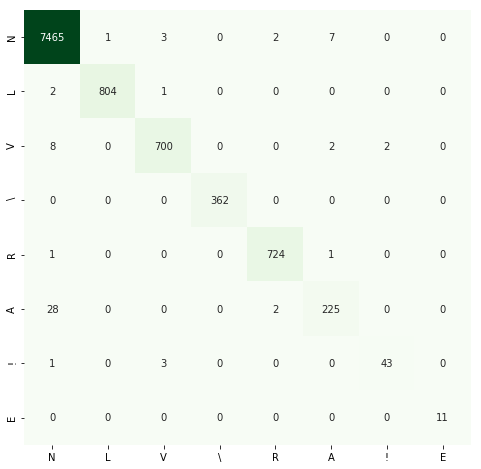

# ECG Arrhythmia classification

The repository contains code (***PyTorch*** framework) for Master's degree dissertation  - 
**Diagnosis of Diseases by ECG Using Convolutional Neural Networks**.
Only CNN neural network models are considered in the paper and repository. 
As a part of the work, more than 30 experiments have been run. 
The table with all experiments and their metrics is available by the [link](https://docs.google.com/spreadsheets/d/159OjSlXuItvngeQwBxC5NaQbU9PjaMN4mY--bX26m1o)

The best **1D** and **2D** CNN models are presented in the repository  
The repository follows *config* principle and can be run in the following modes:
- Training - use `train.py --config configs/training/<config>.json` to train the model
- Validation - use `inference.py --config configs/inference/config.json` to validate the model
- Pipeline - use `pipeline.py --config configs/pipelines/config/json` to test the model using ECG data (i.e. data generation, running, visualization the results)

All available models and all necessary information are described below

***GitHub actions** are used for installing dependencies and running implemented models*

Program - **Data Mining**  
Department - **Computer Science**

Principal Investigator - **Nikolai Yu. Zolotykh**  
National Research University - Higher School of Economics

## Implemented models

#### 1D models:

- [Cardiologist-Level Arrhythmia Detection with Convolutional Neural Networks](https://arxiv.org/abs/1707.01836) 
- [ECG Heartbeat Classification Using Convolutional Neural Networks](https://ieeexplore.ieee.org/stamp/stamp.jsp?arnumber=8952723) 
- [Electrocardiogram Generation and Feature Extraction Using a Variational Autoencoder](https://arxiv.org/pdf/2002.00254.pdf) (encoder only) 
- **Author's EcgResNet34** 

#### 2D models:

- [ECG arrhythmia classification using a 2-D convolutional neural network](https://arxiv.org/abs/1804.06812) 
- MobileNetV2 
- EfficientNetB4 

#### Metrics

|  **name** | **type** | **leads** | **model** | **accuracy** | **val loss** | **epoch** | **batch** | **lr_optim** |
| --- | --- | --- | --- | --- | --- | --- | --- | --- |
|  exp-025 | 1D (1x128) - [PEAK[t] - 64, PEAK[t] + 64] | MLII | https://arxiv.org/pdf/1707.01836.pdf | 0,9827 | 0,0726 | 19 | 128 | 0,001 (Adam ) |
|  exp-030 | 1D (1x128) - [PEAK[t] - 64, PEAK[t] + 64] | MLII | https://ieeexplore.ieee.org/stamp/stamp.jsp?arnumber=8952723 | 0,9864 | 1,5 | 509 | 128 | 0,001 (Adam ) |
|  exp-031 | 1D (1x128) - [PEAK[t] - 64, PEAK[t] + 64] | MLII | https://arxiv.org/pdf/2002.00254.pdf | 0,9886 | 0,15 | 645 | 128 | 0,001 (Adam ) |
|  exp-018 | 2D (128x128) - [PEAK[t] - 64, PEAK[t] + 64] | MLII | https://arxiv.org/pdf/1804.06812.pdf | 0,9920 | 0,1 | 76 | 64 | 0,001 (Adam / 0.95 decay every 1k iter) |
|  exp-013 | 2D (128x128) - [PEAK[t] - 64, PEAK[t] + 64] | MLII | MobileNetV2 | 0,9934 | 0,088 | 251 | 128 | 0,001 (Adam ) |
|  exp-021 | 2D (128x128) - [PEAK[t-1] + 20, PEAK[t+1] - 20] | MLII | EfficientNetB4 | 0,9935 | 0,062 | 154 | 128 | 0,001 (Adam ) |
|  exp-029 | 1D (1x128) - [PEAK[t] - 64, PEAK[t] + 64] | MLII | Novel (ECG ResNet34) | **0,9938** | **0,0500** | 634 | 128 | 0,001 (Adam ) |

## Getting started

Training quick start:

1. [Download](https://storage.googleapis.com/mitdb-1.0.0.physionet.org/mit-bih-arrhythmia-database-1.0.0.zip) 
and unzip files into `mit-bih` directory
2. Install requirements via `pip install -r requirements.txt`
3. Generate 1D and 2D data files running `cd scripts && python dataset-generation-pool.py`
4. Create `json` annotation files
    - For 1D model - `cd scripts && python annotation-generation-1d.py`
    - For 2D model - `cd scripts && python annotation-generation-2d.py`
5. Run training - `python train.py --configs/training/<config>.json`
        
See [CI examples](https://github.com/lxdv/ecg-classification/actions) for each model

## Testing and visualization

- Create directory named `experiments`
- [Download](https://drive.google.com/open?id=1AGqImGEXxdMqNu1Q_MtXGSzyHV4ge6el) the archive and unzip its content into `experiments` directory
- Download [WFDB format](https://www.physionet.org/physiotools/wpg/wpg_35.htm) data
- Change ECG

## Experiments

The code of all experiments described in the [table](https://docs.google.com/spreadsheets/d/159OjSlXuItvngeQwBxC5NaQbU9PjaMN4mY--bX26m1o)
is in branches **experiments/exp-XXX**

## Other

The repository contains Jupyter Notebooks (see `notebooks` folder)

## Contributors

* [Alexander Lyashuk](mailto:lyashuk.me@gmail.com)
* [Nikolai Zolotykh](mailto:nikolai.zolotykh@gmail.com)

## Support

Please give a ⭐️ if this project helped you

## License
This project is licensed under the [MIT](LICENCE) License